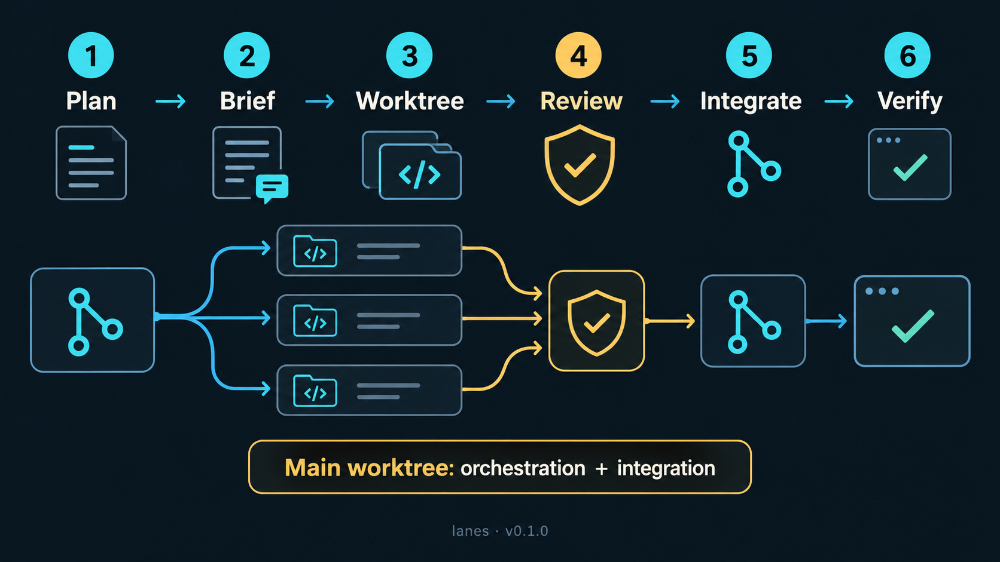
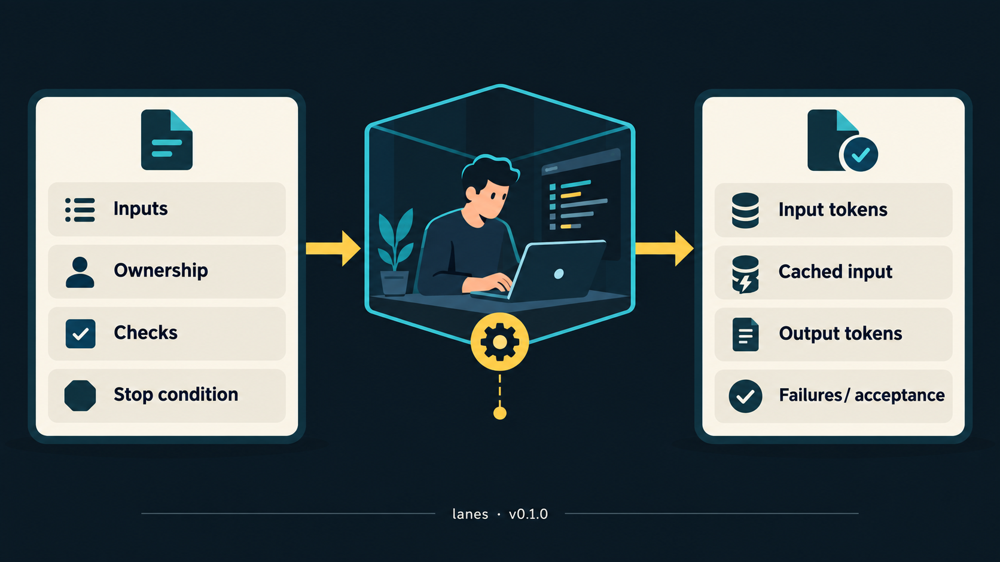

# lanes


`lanes` coordinates independent software tasks in Git worktrees from Claude Code or Codex. The orchestrator plans and reviews; each worker gets a short, complete task in its own worktree.

**Current release: 0.1.0** · [GitHub Pages](https://thebpandey.github.io/lanes/) · [Changelog](CHANGELOG.md)

## Infographics

**Workflow:** Plan → Brief → Worktree → Review → Integrate → Verify.



**Task handoff:** each brief defines inputs, ownership, checks and a stop condition; each completion reports token use, failures and acceptance.



## How work moves

1. The orchestrator checks the project's instructions, current tracker and worktrees, then makes a short dependency-aware plan.
2. Each brief names the task inputs and completed boundary, exact file ownership, acceptance checks, token limits and stop condition.
3. Workers implement only in assigned worktrees. DeepSeek and GLM receive simple, bounded tasks only; neither receives secrets or private data.
4. Completion events replace repeated status scans. One deterministic reconciliation check reports changed-file hashes, check totals and unchanged files.
5. An independent review gates integration. The main worktree is for orchestration, planning, integration and `session-detail` archives before context compaction.

## Model and effort routing

| Work | Recommended routing |
|---|---|
| Routine coordination and review | Codex `gpt-6.1-sol`, medium effort |
| Claude Code orchestration | Opus 5.5, medium effort |
| Legal meaning, security, difficult defects, final acceptance | High effort |
| Bounded structural checks | Codex Luna or deterministic scripts |
| Simple, self-contained implementation | DeepSeek; GLM for the smallest mechanical tasks |
| Moderate coding delegated to Claude | `sonnet-lane`, medium effort |

The per-task usage ledger records input tokens, cached input, output tokens, failures or retries, and acceptance. Default caps are 2,000/500 tokens for structural work or short drafts, 12,000/4,000 for routine work, and 24,000/8,000 for moderate work (input/output). Stop and rebrief when a cap is reached. Keep worker summaries to 10–12 lines and routine tool results to 1,000–2,000 tokens.

## Requirements

- Claude Code, `git`, `python3`, `curl`, and `bash` on Linux or macOS for the Claude provider relays. The watchdog timer is Linux/systemd only.
- `DEEPSEEK_API_KEY` and `OPENROUTER_API_KEY` for external worker providers. Export them in your shell startup file; this skill never stores their values.
- Optional: Codex CLI for Codex review and Luna structural checks; Docker for disposable test databases; Beads (`bd`) for issue tracking.

## Install

```bash
git clone https://github.com/thebpandey/lanes ~/.claude/skills/lanes
bash ~/.claude/skills/lanes/install.sh
```

The installer checks prerequisites, keeps backups of replaced files and tells you how to configure missing keys. Restart Claude Code after installation so its lane agents load.

It installs the DeepSeek and GLM provider relays, Codex review launcher, worktree helpers, and Claude agent definitions in `~/.claude/agents/`.

## Use

Start Claude Code in a Git project and use `/lanes start`, `lane update`, `lane update all`, `pause lanes`, or `resume the lanes`. The orchestrator checks the active tracker and resumes from existing worktrees without resetting local changes.

Direct commands:

```bash
cd <worktree> && RELAY_WAIT_S=6000 model-relay deepseek < brief.md  # or glm for a simple bounded task
cd <worktree> && RELAY_WAIT_S=6000 CODEX_EFFORT=high codex-review main < checklist.md
~/.claude/skills/lanes/lane/new-worktree.sh <branch>
~/.claude/skills/lanes/lane/lane-status.sh
```

`CODEX_MODEL` selects the review model (default `gpt-6.1-sol`); `CODEX_EFFORT` selects `medium` or `high`. Use high effort for the risk cases above. `DEEPSEEK_MODEL` and `GLM_MODEL` override provider models.

## Safety

- Work in assigned worktrees. Never give external providers credentials, `.env` contents, customer data or private records.
- Never use shared or live databases for tests; use a task-owned disposable environment.
- Preserve user changes, stage explicit paths, and follow the project's authorization for commits, pushes, deployments and external writes.
- Before context compaction, create a full `session-detail` archive once per session, then incrementals from verified checkpoints before later compactions.

MIT licensed. Not affiliated with Anthropic, OpenAI, DeepSeek, Z.ai or OpenRouter.
